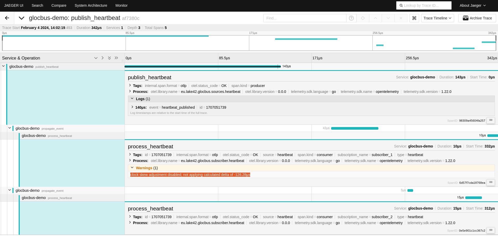

# glocbus

Glocbus is an event bus and a framework to publish events within a Golang application. Based on CloudEvent and OpenTelemetry, Glocbus aims to be fully observable and [provide end-to-end traceability for propagated events](https://opentelemetry.io/docs/specs/semconv/cloudevents/cloudevents-spans/):



## Project status

This is an alpha release: The event bus can be used but its API is not stable yet and more test and documentation must be produced before generating a first stable release.

## Run the demo

An example of an application that uses Glocbus to publish and consume heartbeat events can be found under the example folder.

The easiest way to run the demo and witness how Glocbus fulfills its promise of end-to-end event traceability is to use the docker-compose file. Two containers will be started: One that will run the example and another one that will run a all-in-one jaeger instance (monitoring).

```bash
docker-compose up
```

Once containers have been started, you can open a browser and open the Jaeger UI at http://localhost:16686 to inspect received traces.

## Getting started

Here are the high level steps to use Glocbus:
1. [Implement an event source](./event_source_interface.go) like the one from [the example](./example/sources/heartbeat.go).
2. [Register the event source to the event bus and start it](./example/providers/heartbeat_source_provider.go).
3. [Use the event bus to subscribe to the event source](./example/subscribers/heartbeat.go).

Please take a look at the [example application](./example/main.go) which shows how to implement and use all involved components. The example uses the [uber.fx](https://uber-go.github.io/fx/) framework to manage the application lifecycle and the dependency injection (see [providers](./example/providers/event_bus_provider.go)).